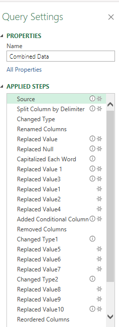
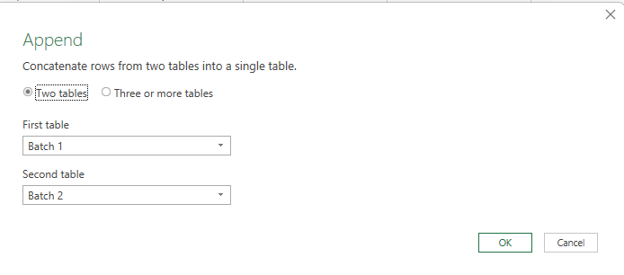
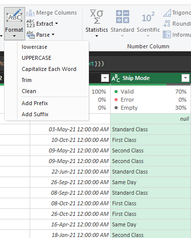
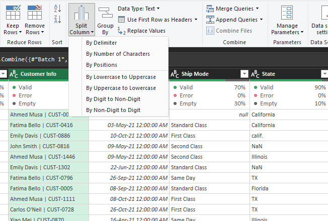
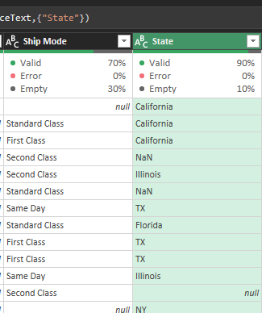
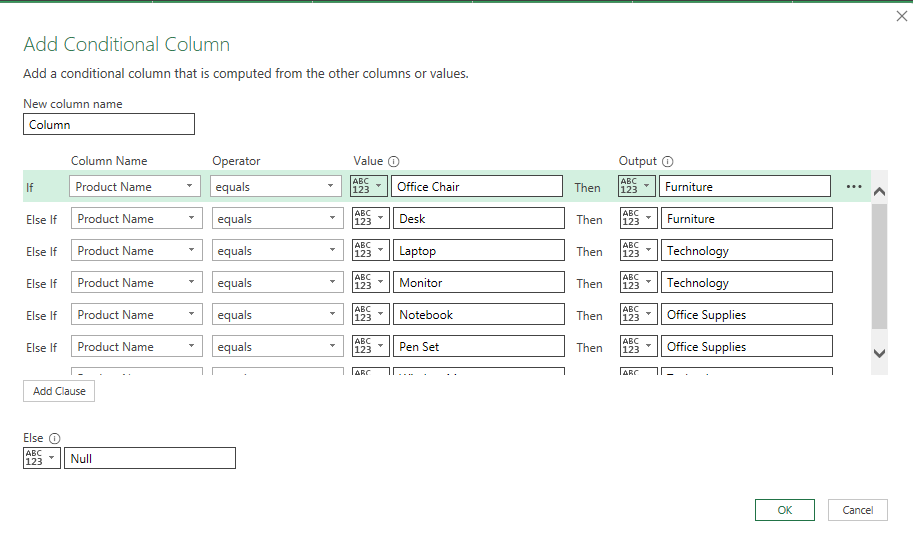

## Superstore Sales Data Cleaning Using Power Query

## The Challenge

I was provided with two batches of Superstore sales data that contained:

- Inconsistent formats across key columns  
- Missing values (dates, states, numerical fields)  
- Duplicate records  

These issues made accurate reporting and analysis impossible.

---

## Goal

To create a **clean, consistent, and analysis-ready dataset** using Power Query in Excel.

---

## Data Quality Log

The following image summarizes the key data quality issues identified and the resolutions applied during the cleaning process:

---

## Before and After Data Sample

The image below illustrates a sample of the raw data alongside the cleaned, structured data after applying Power Query transformations:

---

## Applied Power Query Steps

The following screenshot shows the applied steps in Power Query that were used to clean and transform the data:

---

## Solution Steps

Using Power Query, I performed the following transformations:

- **Appended** both data batches into one table  
- **Split** full customer info into Customer ID and Customer Name  
- **Cleaned** and converted inconsistent date formats  
- **Standardized** categorical fields like `State` and `Ship Mode`  
- **Corrected** numerical fields (`Sales`, `Quantity`) for consistency  

Detailed transformation steps and screenshots are provided below.

---

## Transformations Applied

### 1. Append Queries  
Combine multiple data tables (Batch 1 + Batch 2) into a single dataset.  

---

### 2. Capitalize Text  
Format names properly (e.g., "standard class" to "Standard Class").  

---

### 3. Split Columns  
Split Customer Info into `Customer ID` and `Customer Name` using a `|` delimiter.  

---

### 4. Replace Values  
Replace specific values (e.g., `"calif."` to `"California"`).  

**Original Data:**  

**Power Query Step:**  

---

### 5. Conditional Column  
Replace nulls in conditional column using logic based on Category and Product Name.

---

## Tools Used

- Microsoft Excel (Power Query Editor)  
- Power Query M Language  
- Excel formulas and data model  

---

## How to Use

1. Open the file `data/raw_data.xlsx` in Excel.  
2. Launch Power Query Editor.  
3. Follow the steps outlined in `Data_Cleaning.PQ.txt`.  
4. Save the output to `data/cleaned_data.xlsx`.  

---

## License

This project is open-source and available under the [MIT License](LICENSE).

---

## Acknowledgements

Thank you for visiting this project. Feel free to fork, clone, or adapt it for your own workflows.
